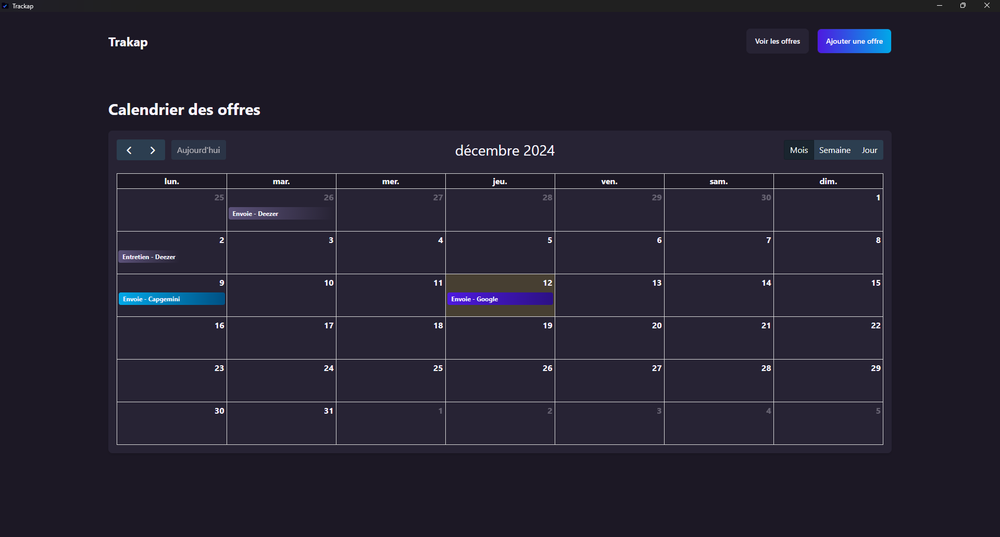

# Trakap

 &nbsp; 
 &nbsp; 
 &nbsp; 
 &nbsp; 


### 📝 Description

Trakap is an all-in-one application designed to streamline the management of tasks, projects, and personal workflows.

### 🌱 Goal

Initially focused on managing job applications, Trakap offers powerful tools to organize and track your progress. Our goal is to expand Trakap into a more versatile productivity tool that adapts to your needs, whether you're job hunting, managing projects, or tracking your daily tasks.

---

## 📸 Screenshots

Take a look at some screenshots of **Trakap** in action :

### Dashboard


### Jobboard


### Calendar



---

## ✏️ Authors

- <a href="https://github.com/MarinSH"></a> Creator and Maintainer
- <a href="https://github.com/ymerej-noyorb">
</a> Maintainer
- <a href="https://github.com/Maxime-Godefroy"></a> Contributor 

---

## 🧰 Tech Stack

- 
- 
- 
- 
- 
- 
- 

---

## 🚨 Requirements

### 🎯 Node.js

- **Minimum version** :  (Download it from [here](https://github.com/nodejs/node/releases/tag/v20.14.0) or visit the official Node.js website [https://nodejs.org](https://nodejs.org))

- **Why this version?**  
  This version is required because it includes important features and bug fixes necessary for the smooth functioning of the app.

You can check your current version by running the following command :

```sh
node -v
```

If you don't have the correct version, you can upgrade using nvm or manually download it from the official Node.js website.

---

## 💽 Installation

```sh
git clone https://github.com/MarinSH/trakap.git
```
```sh
cd trakap
```
```sh
npm install
```

---

## 🚀 Running

To get started with Trakap, follow these instructions depending on your use case :

### ⚙️ For Contributing (Development Mode)

To start the app in development mode and contribute to the project, run the following command :

```sh
npm start
```

This will :

- Launch the app in development mode.
- Enable hot-reloading for easy code changes.

### 🏗️ For Usage (Production Build)

If you just want to use the app and create a production-ready build, run :

```sh
npm package
```

This will :

- Package the app for production use.
- Generate an executable file that you can run on your system.

---

## 🤝 Contributing

Pull requests are welcome. For major changes, please open an issue first to discuss what you would like to change.

For more details, check contributing file : [CONTRIBUTING.md](./CONTRIBUTING.md)

---

## 🧾 License

This project is licensed under **MIT with Commons Clause**. This means:  
- You are free to use, modify, and redistribute the code, as long as you include a copy of this license.  
- **Commercial use is strictly prohibited** unless prior written permission is obtained from the authors.


The project uses a modified version of the MIT license : [LICENSE.md](./LICENSE.md)